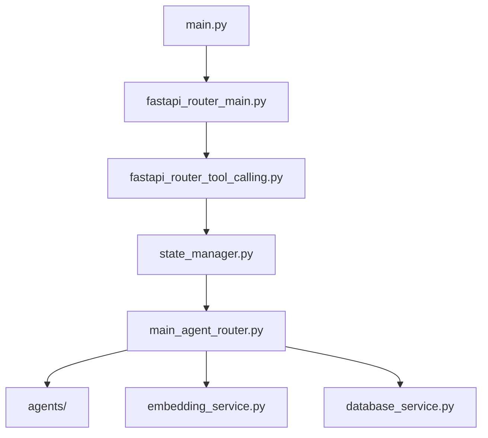
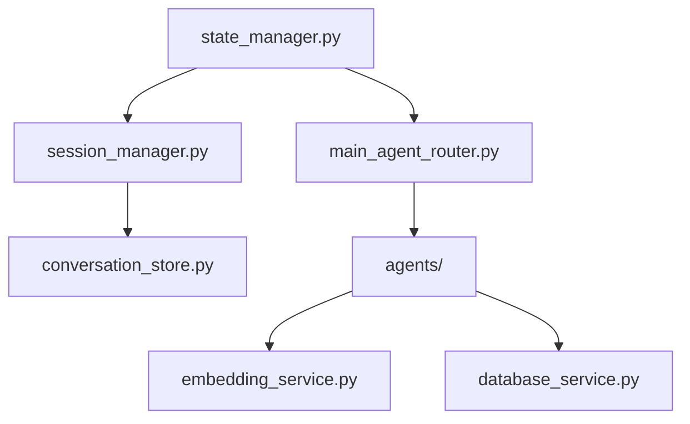
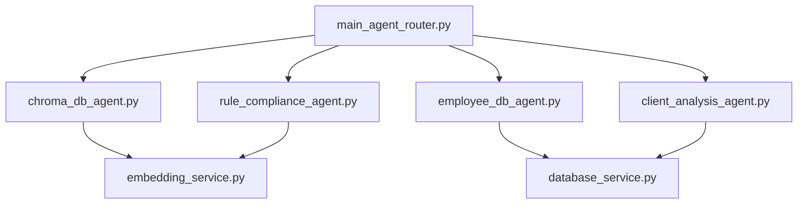

# 📋 Backend 폴더 구조 및 연결성 분석 보고서

**작성일**: 2024-07-14  
**프로젝트**: NaruTalk AI 챗봇  
**분석 범위**: backend/ 폴더 전체 구조

---

## 📁 전체 폴더 구조

```
backend/
├── main.py                                    # FastAPI 애플리케이션 진입점
└── app/                                       # 메인 애플리케이션 패키지
    ├── __init__.py                           # 패키지 초기화
    ├── api/                                  # API 라우터 모듈
    │   ├── __init__.py                       # API 패키지 초기화
    │   ├── fastapi_router_main.py            # 메인 API 라우터 (172 lines)
    │   └── routers/                          # 라우터 하위 모듈
    │       ├── __init__.py                   # 라우터 패키지 초기화 (15 lines)
    │       └── fastapi_router_tool_calling.py # Tool Calling 라우터 (310 lines)
    ├── core/                                 # 핵심 설정 모듈
    │   ├── __init__.py                       # Core 패키지 초기화
    │   └── config.py                         # 애플리케이션 설정 (92 lines)
    ├── services/                             # 비즈니스 로직 서비스
    │   ├── __init__.py                       # Services 패키지 초기화
    │   ├── main_agent_router.py              # 메인 Agent 라우터 (256 lines)
    │   ├── embedding_service.py              # 임베딩 서비스 (274 lines)
    │   ├── database_service.py               # 데이터베이스 서비스 (260 lines)
    │   ├── state_management/                 # 상태 관리 모듈
    │   │   ├── __init__.py                   # State Management 패키지 초기화 (21 lines)
    │   │   ├── state_schema.py               # 상태 스키마 정의 (131 lines)
    │   │   ├── state_manager.py              # 상태 관리자 (359 lines)
    │   │   ├── session_manager.py            # 세션 관리자 (244 lines)
    │   │   └── conversation_store.py         # 대화 저장소 (273 lines)
    │   └── agents/                           # 전문 Agent 모듈
    │       ├── __init__.py                   # Agents 패키지 초기화 (21 lines)
    │       ├── chroma_db_agent.py            # ChromaDB Agent (미구현)
    │       ├── employee_db_agent.py          # 직원 DB Agent (313 lines)
    │       ├── client_analysis_agent.py      # 고객 분석 Agent (490 lines)
    │       ├── rule_compliance_agent.py      # 규정 준수 Agent (331 lines)
    │       └── db_agent.py                   # DB Agent (195 lines)
    └── utils/                                # 유틸리티 모듈 (빈 폴더)
```

---

## 🏗️ 아키텍처 개요

### 핵심 아키텍처 패턴
- **FastAPI 기반 RESTful API**
- **LangGraph StateGraph 기반 상태 관리**
- **OpenAI Function Calling 기반 Agent 라우팅**
- **4개 전문 Agent 시스템**
- **세션 기반 대화 컨텍스트 관리**

### 주요 기술 스택
- **웹 프레임워크**: FastAPI
- **상태 관리**: LangGraph 0.5.2
- **AI 모델**: OpenAI GPT-4o, nlpai-lab/KURE-v1, dragonkue/bge-reranker-v2-m3-ko
- **데이터베이스**: SQLite, ChromaDB
- **임베딩**: SentenceTransformers

---

## 📄 파일별 상세 분석

### 1. **main.py** (99 lines) - 애플리케이션 진입점

**역할**: FastAPI 애플리케이션 초기화 및 설정

**주요 기능**:
- FastAPI 앱 생성 및 설정
- CORS 미들웨어 설정
- API 라우터 등록 (`/api/v1` prefix)
- 정적 파일 서빙 (프론트엔드)
- 기본 엔드포인트 (`/`, `/health`, `/favicon.ico`)

**연결점**:
```python
from app.api.fastapi_router_main import api_router  # 메인 API 라우터
from app.core.config import settings               # 설정 관리
```

**핵심 코드**:
```python
app = FastAPI(
    title="NaruTalk AI 챗봇",
    description="랭그래프를 활용한 AI 챗봇 시스템",
    version="1.0.0"
)

# API 라우터 등록
app.include_router(api_router, prefix="/api/v1")
```

---

### 2. **app/core/config.py** (92 lines) - 설정 관리

**역할**: 애플리케이션 전체 설정 관리

**주요 설정**:
- OpenAI API 설정
- HuggingFace 모델 설정
- 데이터베이스 경로 설정
- LangGraph 설정

**핵심 설정**:
```python
class Settings(BaseSettings):
    # OpenAI 설정
    openai_api_key: Optional[str] = os.getenv("OPENAI_API_KEY")
    openai_model: str = "gpt-4o"
    
    # 허깅페이스 모델 ID
    embedding_model_id: str = "nlpai-lab/KURE-v1"
    reranker_model_id: str = "dragonkue/bge-reranker-v2-m3-ko"
    
    # 데이터베이스 설정
    chroma_db_path: str = str(project_root / "database" / "chroma_db")
    sqlite_db_path: str = str(project_root / "database" / "relationdb")
```

**연결점**: 모든 서비스에서 `from ..core.config import settings`로 접근

---

### 3. **app/api/fastapi_router_main.py** (172 lines) - 메인 API 라우터

**역할**: 전체 API 엔드포인트 통합 관리

**주요 기능**:
- 시스템 정보 엔드포인트 (`/system/info`)
- 헬스 체크 (`/health`)
- Tool Calling 라우터 등록
- Legacy 호환성 엔드포인트

**연결점**:
```python
from .routers.fastapi_router_tool_calling import router as state_managed_router
api_router.include_router(state_managed_router, prefix="/tool-calling", tags=["State Managed Chat"])
```

**핵심 엔드포인트**:
- `/api/v1/system/info`: 시스템 정보
- `/api/v1/health`: 헬스 체크
- `/api/v1/tool-calling/*`: Tool Calling 관련 엔드포인트

---

### 4. **app/api/routers/fastapi_router_tool_calling.py** (310 lines) - Tool Calling 라우터

**역할**: State Manager 기반 채팅 API 처리

**주요 기능**:
- 스트리밍 채팅 (`/chat/stream`)
- 일반 채팅 (`/chat`)
- 대화 기록 관리
- 세션 관리

**연결점**:
```python
from ...services.state_management import StateManager
state_manager = StateManager()
```

**핵심 엔드포인트**:
```python
@router.post("/chat/stream")      # 스트리밍 채팅
@router.post("/chat")             # 일반 채팅
@router.get("/conversation/history/{session_id}")  # 대화 기록
@router.get("/session/stats/{session_id}")         # 세션 통계
@router.delete("/session/{session_id}")            # 세션 삭제
```

---

### 5. **app/services/main_agent_router.py** (256 lines) - 메인 Agent 라우터

**역할**: OpenAI Function Calling을 통한 4개 전문 Agent 라우팅

**주요 기능**:
- 사용자 메시지 분석
- 적절한 Agent 선택
- Agent 실행 및 결과 반환

**4개 전문 Agent**:
1. **chroma_db_agent**: 문서 검색 및 질문답변
2. **employee_db_agent**: 직원 정보 검색
3. **client_analysis_agent**: 고객 데이터 분석
4. **rule_compliance_agent**: 규정 준수 분석

**연결점**:
```python
# Agent 실행
if function_name == "chroma_db_agent":
    from .agents.chroma_db_agent import ChromaDBAgent
    agent = ChromaDBAgent()
    return await agent.process(function_args, original_message)
```

**핵심 메서드**:
```python
async def route_message(self, message: str, user_id: str = None, session_id: str = None)
async def _execute_agent(self, function_name: str, function_args: Dict[str, Any], original_message: str)
```

---

### 6. **app/services/embedding_service.py** (274 lines) - 임베딩 서비스

**역할**: 텍스트 임베딩 및 유사도 검색

**주요 기능**:
- 텍스트 임베딩 생성
- 문서 유사도 검색
- 검색 결과 리랭킹

**사용 모델**:
- 임베딩: `nlpai-lab/KURE-v1`
- 리랭커: `dragonkue/bge-reranker-v2-m3-ko`

**연결점**: `chroma_db_agent`, `rule_compliance_agent`에서 사용

**핵심 메서드**:
```python
async def embed_text(self, text: str) -> Optional[List[float]]
async def embed_documents(self, documents: List[str]) -> Optional[List[List[float]]]
async def search_similar_documents(self, query: str, documents: List[str], limit: int = 5)
```

---

### 7. **app/services/database_service.py** (260 lines) - 데이터베이스 서비스

**역할**: SQLite 데이터베이스 관리

**주요 기능**:
- 직원 정보 검색
- 고객 데이터 관리
- 회사 문서 관리

**연결점**: `employee_db_agent`, `client_analysis_agent`에서 사용

**핵심 메서드**:
```python
async def search_employee_info(self, query: str) -> Optional[str]
async def get_all_employees(self) -> List[Dict[str, Any]]
async def get_company_documents(self) -> List[str]
```

---

### 8. **app/services/state_management/** - 상태 관리 모듈

#### 8.1 **state_schema.py** (131 lines) - 상태 스키마 정의

**역할**: LangGraph StateGraph에서 사용할 상태 구조 정의

**주요 클래스**:
- `MessageRole`: 메시지 역할 (USER, ASSISTANT, SYSTEM)
- `AgentType`: 에이전트 타입 (CHROMA_DB, EMPLOYEE_DB, CLIENT_ANALYSIS, RULE_COMPLIANCE)
- `MessageState`: 개별 메시지 상태
- `ConversationState`: 대화 상태 (LangGraph용)
- `SessionInfo`: 세션 정보

**핵심 구조**:
```python
class ConversationState(TypedDict):
    session_id: str
    user_id: Optional[str]
    current_message: str
    messages: List[MessageState]
    current_agent: Optional[AgentType]
    agent_arguments: Dict[str, Any]
    last_agent_response: str
    conversation_metadata: Dict[str, Any]
    sources: List[Dict[str, Any]]
    should_continue: bool
    error_message: Optional[str]
    route_confidence: float
    route_history: List[Dict[str, Any]]
```

#### 8.2 **state_manager.py** (359 lines) - 상태 관리자

**역할**: LangGraph StateGraph 기반 대화 상태 관리

**주요 기능**:
- LangGraph 워크플로우 생성
- 대화 상태 처리
- 에이전트 라우팅
- 응답 생성

**LangGraph 워크플로우**:
```
process_user_input → route_to_agent → execute_agent → generate_response → save_state
```

**연결점**:
```python
from .session_manager import SessionManager
from ..main_agent_router import MainAgentRouter
```

**핵심 메서드**:
```python
async def process_message(self, message: str, session_id: Optional[str] = None, user_id: Optional[str] = None)
async def _route_to_agent(self, state: ConversationState) -> ConversationState
async def _generate_response(self, state: ConversationState) -> ConversationState
```

#### 8.3 **session_manager.py** (244 lines) - 세션 관리자

**역할**: 세션별 상태 관리 및 대화 컨텍스트 유지

**주요 기능**:
- 세션 생성/조회/삭제
- 대화 컨텍스트 관리
- 세션 타임아웃 처리
- 메시지 추가/조회

**연결점**:
```python
from .conversation_store import ConversationStore
```

**핵심 메서드**:
```python
def create_session(self, user_id: Optional[str] = None, metadata: Optional[Dict] = None) -> str
def get_or_create_session(self, session_id: Optional[str] = None, user_id: Optional[str] = None) -> str
def get_conversation_context(self, session_id: str, max_messages: int = 10) -> List[MessageState]
```

#### 8.4 **conversation_store.py** (273 lines) - 대화 저장소

**역할**: SQLite를 사용한 대화 기록 지속 저장소

**주요 기능**:
- 대화 기록 저장/조회
- 세션 정보 관리
- 데이터베이스 초기화

**데이터베이스 구조**:
- `sessions` 테이블: 세션 정보
- `messages` 테이블: 메시지 기록

**핵심 메서드**:
```python
def save_message(self, session_id: str, message: MessageState)
def get_conversation_history(self, session_id: str, limit: int = 50) -> List[MessageState]
def get_recent_context(self, session_id: str, context_length: int = 10) -> List[MessageState]
```

---

### 9. **app/services/agents/** - 전문 Agent 모듈

#### 9.1 **employee_db_agent.py** (313 lines) - 직원 DB Agent

**역할**: 직원 데이터베이스 검색 및 조직 관리

**주요 기능**:
- 직원 정보 검색
- 부서별 직원 조회
- 조직도 확인
- 연락처 조회

**연결점**:
```python
from ..database_service import DatabaseService
```

#### 9.2 **client_analysis_agent.py** (490 lines) - 고객 분석 Agent

**역할**: 고객 데이터 분석 및 비즈니스 인사이트

**주요 기능**:
- 고객 프로필 분석
- 거래 이력 분석
- 매출 분석
- 고객 세그먼트 분석

**연결점**:
```python
from ..database_service import DatabaseService
```

#### 9.3 **rule_compliance_agent.py** (331 lines) - 규정 준수 Agent

**역할**: 컴플라이언스 및 규정 준수 분석

**주요 기능**:
- 규정 검토
- 위험 분석
- 준수성 확인
- 규정 정보 제공

**연결점**:
```python
from ..embedding_service import EmbeddingService
```

#### 9.4 **db_agent.py** (195 lines) - DB Agent

**역할**: 범용 데이터베이스 Agent

**주요 기능**:
- 다양한 데이터베이스 조회
- 데이터 분석
- 보고서 생성

---

## 🔗 연결성 분석

### 1. **API 계층 연결성**



### 2. **상태 관리 연결성**



### 3. **Agent 시스템 연결성**



### 4. **데이터 흐름**

```
사용자 요청 → API 라우터 → State Manager → Agent Router → 전문 Agent → 서비스 → 응답
```

**상세 흐름**:
1. **HTTP 요청**: `fastapi_router_tool_calling.py`
2. **상태 관리**: `state_manager.py` (LangGraph 워크플로우)
3. **Agent 라우팅**: `main_agent_router.py` (OpenAI Function Calling)
4. **전문 처리**: 각 Agent (`agents/`)
5. **서비스 호출**: `embedding_service.py`, `database_service.py`
6. **응답 생성**: 결과를 역순으로 전달

---

## 🎯 핵심 특징

### 1. **LangGraph 기반 상태 관리**
- StateGraph를 통한 대화 흐름 제어
- 세션별 상태 지속성
- 컨텍스트 유지

### 2. **OpenAI Function Calling**
- 4개 전문 Agent 자동 라우팅
- 사용자 의도 분석
- 적절한 Agent 선택

### 3. **모듈화된 아키텍처**
- 명확한 책임 분리
- 확장 가능한 구조
- 테스트 용이성

### 4. **한국어 특화 모델**
- KURE-v1 임베딩 모델
- BGE-reranker-v2-m3-ko 리랭커
- 한국어 성능 최적화

---

## 📊 파일별 통계

| 파일명 | 라인 수 | 역할 | 복잡도 |
|--------|---------|------|--------|
| state_manager.py | 359 | 상태 관리자 | 높음 |
| client_analysis_agent.py | 490 | 고객 분석 Agent | 높음 |
| conversation_store.py | 273 | 대화 저장소 | 중간 |
| session_manager.py | 244 | 세션 관리자 | 중간 |
| fastapi_router_tool_calling.py | 310 | Tool Calling 라우터 | 중간 |
| embedding_service.py | 274 | 임베딩 서비스 | 중간 |
| database_service.py | 260 | 데이터베이스 서비스 | 중간 |
| main_agent_router.py | 256 | Agent 라우터 | 중간 |
| rule_compliance_agent.py | 331 | 규정 준수 Agent | 중간 |
| employee_db_agent.py | 313 | 직원 DB Agent | 중간 |
| fastapi_router_main.py | 172 | 메인 API 라우터 | 낮음 |
| state_schema.py | 131 | 상태 스키마 | 낮음 |
| main.py | 99 | 애플리케이션 진입점 | 낮음 |
| config.py | 92 | 설정 관리 | 낮음 |

**총 라인 수**: 3,444 lines

---

## 🔧 개발 가이드

### 1. **새로운 Agent 추가**
1. `app/services/agents/`에 새 Agent 파일 생성
2. `main_agent_router.py`에 Function 정의 추가
3. `state_schema.py`에 AgentType enum 추가
4. 필요한 서비스 연결

### 2. **새로운 서비스 추가**
1. `app/services/`에 새 서비스 파일 생성
2. `config.py`에 설정 추가
3. 관련 Agent에서 사용

### 3. **새로운 API 엔드포인트 추가**
1. `app/api/routers/`에 새 라우터 파일 생성
2. `fastapi_router_main.py`에 등록
3. 필요한 서비스 연결

---

## 🚀 성능 최적화 포인트

### 1. **모델 로딩 최적화**
- 지연 로딩 (Lazy Loading) 구현
- 모델 캐싱
- 메모리 사용량 최적화

### 2. **데이터베이스 최적화**
- 인덱스 활용
- 쿼리 최적화
- 연결 풀링

### 3. **상태 관리 최적화**
- 메모리 사용량 제한
- 세션 타임아웃 관리
- 불필요한 데이터 정리

---

## 📝 결론

NaruTalk AI 챗봇의 backend 구조는 **모듈화된 마이크로서비스 아키텍처**를 기반으로 하며, **LangGraph StateGraph**와 **OpenAI Function Calling**을 활용한 **지능형 Agent 시스템**을 구현하고 있습니다.

**주요 강점**:
- 명확한 책임 분리
- 확장 가능한 구조
- 한국어 특화 최적화
- 상태 지속성 보장

**개선 가능 영역**:
- 에러 처리 강화
- 로깅 시스템 개선
- 성능 모니터링 추가
- 테스트 커버리지 확대

이 구조를 통해 **유지보수성**, **확장성**, **성능**을 모두 고려한 견고한 AI 챗봇 시스템을 구축할 수 있습니다. 